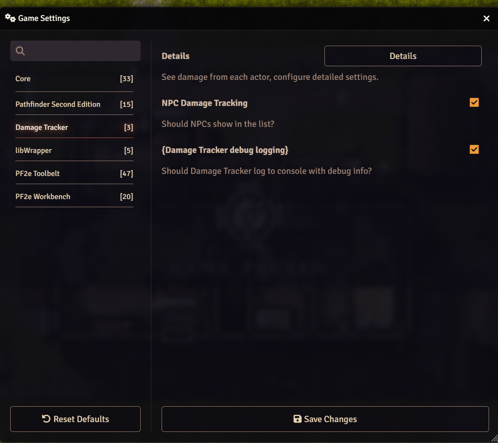
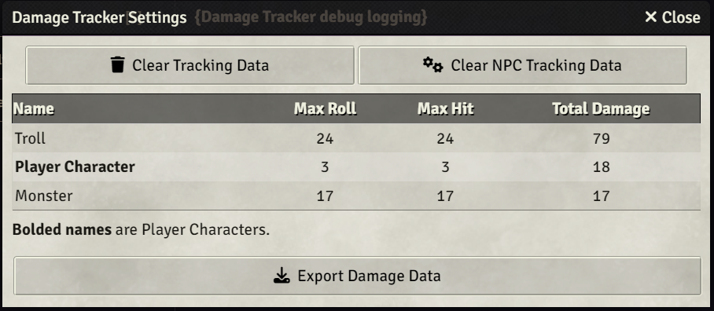

# DamageTracker
Foundry Virtual Tabletop framework module for tracking biggest hits and cumulative damage done.

# Basic Settings

2 settings on this page:
1. NPC Damage Tracking determines whether you want to save NPC data in DamageTracker.  If you want PCs only, turn this off.
2. Debug Logging - this results in significanlty more "DamageTraacker |" messages in the debug console.

Clicking on the [Details] button will bring up the primary UI for DamageTracker:

# DamageTracker Details

The buttons do what you'd expect:
  [Clear Tracking Data] will delete all tracking data.
  [Clear NPC Tracking Data] will delete any NPC data.  

Bolded names in the list are PCs, non-bolded are NPCs.

  [Export Damage Data] will produce a copyable HTML doc.  If you save this as a .html file and open in a browser, you'll get a similar looking table.

This allows you to periodically clear the data (or see NPC data) before clearing it.

# Terminology
Description of the different columns:
  Max Roll = The maximum damage amount the creature/actor rolled.  
  Max Hit  = The maximum damage done, could be smaller than the Max Roll if the creature didn't have that many hitpoints, had resistance, made a save, etc.
  Total Damage = The cumulative damage done (while the log has been collecting).

