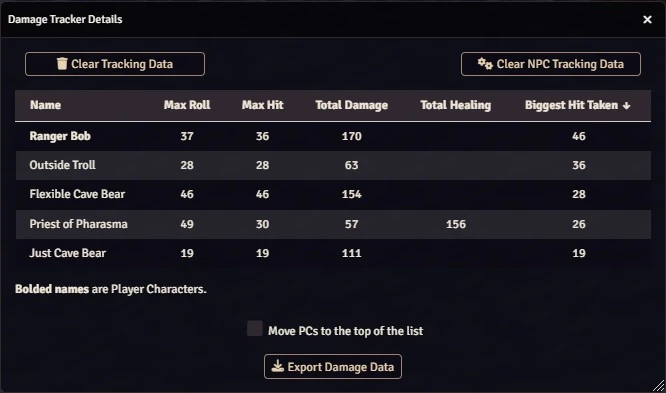

# DamageTracker
Foundry Virtual Tabletop framework module for tracking biggest hits and cumulative damage done.

# Basic Settings

2 settings on this page:
1. NPC Damage Tracking determines whether you want to save NPC data in DamageTracker.  If you want PCs only, turn this off.
2. Debug Logging - this results in significanlty more "DamageTraacker |" messages in the debug console.

Clicking on the [Details] button will bring up the primary UI for DamageTracker:

# DamageTracker Details

**Bolded** names in the list are PCs, non-bolded are NPCs.

The buttons do what you'd expect:
- [Clear Tracking Data] will delete all tracking data.
- [Clear NPC Tracking Data] will delete any NPC data.  
- [Export Damage Data] will produce a copyable HTML doc.  If you save this as a .html file and open in a browser, you'll get a similar looking table. This allows you to periodically clear the data (or see NPC data) before clearing it.

# Terminology
Description of the different columns:
  - Max Roll = The maximum damage amount the creature/actor rolled (or did).
  - Max Hit  = The maximum damage done, could be smaller than the Max Roll if the creature didn't have that many hitpoints, had resistance, made a save, etc.
  - Total Damage = The cumulative damage done (while the log has been collecting).

# Usage Details
There are a couple ways you can use this module, both are basically for vanity/bragging rights for your players (or you if you're a malicious sort of GM).

 1. Use it to feed a dashboard for the players.  I previously had something where I'd analyze the log files to keep track of 
      - Biggest Hitter: (PC who's done the most damage in a single strike)
      - Biggest Hittee: (PC who took the biggest hit)
      - Most Lethal:    (Enemy who did the most cumulative damage)
      - Most Fearsome:  (Highest CR enemy)
      
      This module doesn't deal with CRs or who is the biggest hittee (though the last one might be something I do at some point).

      Using these you could build a "Player Home" screen.
  
  2. A curiousity for anyone interested.
      Damage Tracker is viewable by players as well.  This is a good reason to disable NPC tracking (i.e. just track PC damages).
      - Over the course of a campaign, people might like to know how much damage they've done.  
      - You could take snapshots (using the Export button) at each milestone of your campaign.
      - Through careful enabling/disabling of tracking NPCs, you could exclude all but the most pivotal battles - this is why disabling NPC tracking doesn't clear the NPCs from the list.

## A word or two about the different stats:
  Max Roll tries to get the BIGGEST damage ever done or conceivably done.  For example:
  - If you did 34 points of damage to something with 5 hp, Max Roll will record 34 (while damage Total Damage will go up by 5).
  - Similarly, if you cast a fireball and did 30 hp damage, but someone critically failed their save - Max Roll will record 60 (Total will go up by at least 60 as well).
  - Same story for vulnerabilities, resistances, etc.  You might roll 15 hp of damage but do 25 damage (which could be a new max) or 5 damage (but record 15 as a max if that's your largest roll so far).

  Damage reverting will cancel the whole damage.
  - Subtract from Total Damage.
  - Clear your Max Roll and Max Hit if it was the largest you had.
  - I will probably implement a "previous max" strategy in code to avoid setting it to 0, but I'm not going to keep track of all your rolls.

